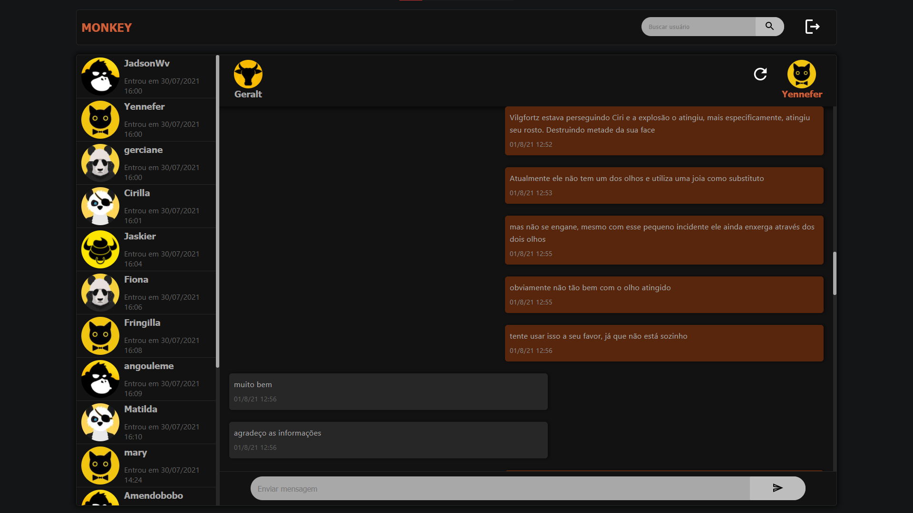
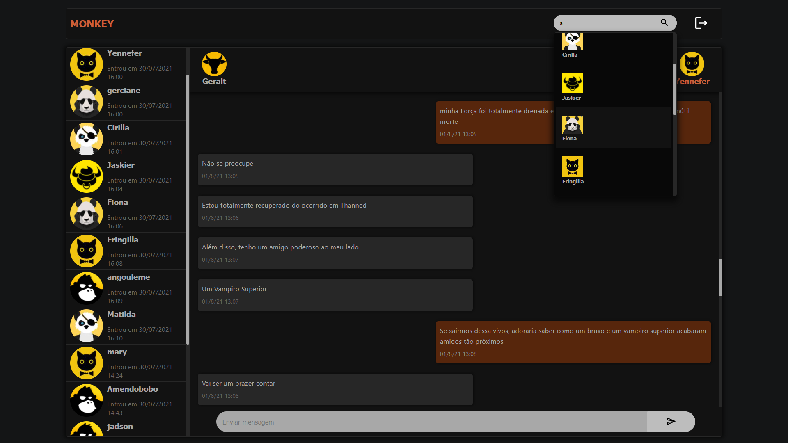
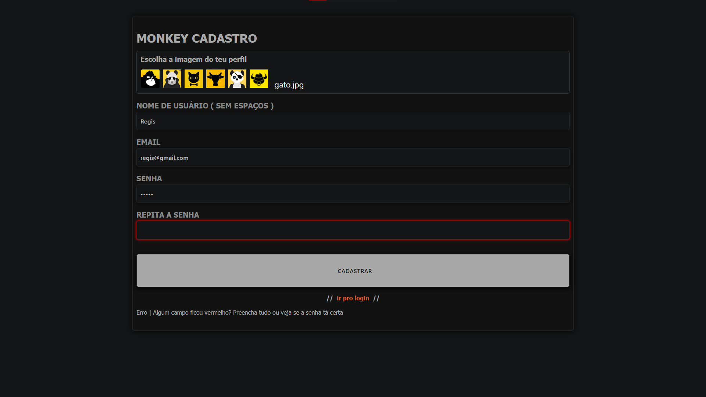

# CHAT PHP + AJAX (js puro)
## Como rodar
- criar o banco de dados que está na pasta database
- atentar para a url index: http://localhost/ajax/chat/index.php
- verificar o arquivo de conexão com o banco pois o meu mysql tem senha
- usuários que tem diálogo pronto: 
    - username: geralt, senha: geralt
    - username: yennefer, senha: yen

# Detalhes da aplicação

## PHP
- classes com métodos instanciados em arquivos dentro da pasta requests, todos os arquivos retornam um json
- há três pastas dentro de requests: chat, message, user
- cada pasta com os métodos de registro e retorno de dados
- alguns métodos utilizam a sessão do PHP junto com o POST do AJAX para definir os parâmetros que vão na query do banco de dados
- as requisições AJAX são direcionadas para estes arquivos dentro de requests

# Requisições AJAX
## Cadastro
- verifica se o username contém espaços - sem ajax
- verifica se o username já existe - com ajax
- verifica se o email já existe - com ajax
- verifica se senha e confirmar senha são iguais - sem ajax
- se tudo está ok, faz a requisição post para o método que registra o usuário no banco - com ajax

## Chat
- ao carregar a página faz requisição dos usuários cadastrados e renderiza o componente com a lista de usuários
- ao clicar em um usuário ocorrem: 
    - requisição para o método que cria um novo chat e retorna seu id, caso o chat já exista não cria um novo
    - requisição para o método que retorna os dados do usuário que foi clicado
    - requisição para as mensagens do chat
- ao clicar no campo de busca o evento "keyup" faz requisição para o método que retorna os usuários que contém os caracteres digitados no username
- ao clicar em um usuário na lista de pesquisados é feita a requisição do chat entre você e aquele usuário
- ao clicar no ícone de reload, o chat é atualizado com nova requisição ajax

## JS componentes
- lista de usuários 
- lista de usuários na pesquisa
- componente do amigo na conversa